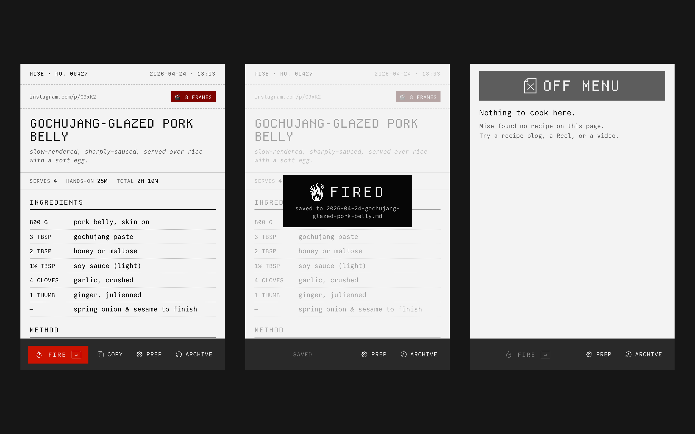

# Mise

Mise is a browser extension that turns a recipe into a Markdown file you keep. It reads Reels, TikToks, YouTube videos and blog posts. A card fills in as Mise reads the page; Enter writes the file and closes the window.

It is not a recipe app. There is no account, no library and no format only Mise can read. You fire a recipe, you get a `.md` file, and you leave. The file opens in Notes, Obsidian, Notion or a text editor, and it will still open when Mise is gone.



## Install

1. Download `mise-v0.1.1.zip` from the [latest release](https://github.com/benjl1393/mise-recipes/releases/latest) and unzip it.
2. Open `chrome://extensions`, turn on **Developer mode**, click **Load unpacked** and choose the unzipped folder.
3. Click the Mise icon, open **Prep** and paste an API key.

Mise runs in Chrome and other Chromium browsers.

## Your key

Mise has no server. Your key is stored in this browser and sent only to the provider it belongs to; you pay that provider directly. Each recipe is one API call.

| Provider | Fast | Thorough |
|---|---|---|
| Anthropic | `claude-haiku-4-5` | `claude-opus-5-5` |
| OpenAI | `gpt-6-luna` | `gpt-6.1-sol` |
| Gemini | `gemini-3.5-flash-lite` | `gemini-3.8-flash` |
| Grok | `grok-4.3` | `grok-4.7` |
| Mistral | `mistral-small-latest` | `mistral-medium-latest` |
| OpenRouter | `google/gemini-3.5-flash-lite` | `anthropic/claude-opus-5.5` |
| Custom | any OpenAI-compatible endpoint, including a local server that needs no key | |

Paste a key and Prep picks the provider from its prefix. Anthropic is tested end to end against the live API; the other providers are new and tested against their documented APIs.

## Use

- **Fire.** On a recipe page, Reel, TikTok or YouTube video, click the Mise icon (`⌘⇧M` on macOS, `Ctrl+Shift+M` elsewhere) and press Enter. The `.md` lands in your Downloads folder.
- **Copy.** Puts the same `.md` on the clipboard instead.
- **Archive.** Everything you have fired from this browser.
- **Prep.** Provider, key, Fast or Thorough, metric or imperial, video frames, and whether the icon turns red when a page declares a recipe.

## The file

```markdown
---
ticket: "00001"
captured: 2026-08-17T18:00:00+02:00
source: https://example.com/gochujang-pork-belly
via: article text
serves: 4
hands_on: 25m
total: 2h 10m
---

# Weeknight Gochujang Pork Belly

## Ingredients
- 800 g  |  pork belly, skin on
- 3 tbsp  |  gochujang
- 4 cloves  |  garlic, crushed

## Method
1. Score the skin in a crosshatch and salt it heavily.
2. Sear skin down in a dry cast iron pan until it blisters.

---
#korean · #pork · #roast · #weeknight

✶ mise.app
```

The full format is in [`docs/mise-md-format.md`](docs/mise-md-format.md).

## Build from source

```bash
npm ci
npm run build:ext   # bundles to extension/dist; load that folder unpacked
npm run test:ext    # unit tests
npm run smoke:ext   # boots the built extension in Chromium (npx playwright install chromium first)
```

The popup's stylesheet and icons are not written by hand. They are generated from the design specimen, `type-specimens/popup-states.html`, by `npm run port:design`. The case study is on [benjaminli.xyz](https://benjaminli.xyz).

## Credits

Departure Mono by Helena Zhang and Tobias Fried. Commit Mono by Eigil Nikolajsen. Icons from Tabler, by Paweł Kuna. All three are MIT; see [`THIRD_PARTY_NOTICES.md`](THIRD_PARTY_NOTICES.md).

## Licence

MIT. See [`LICENSE`](LICENSE).
